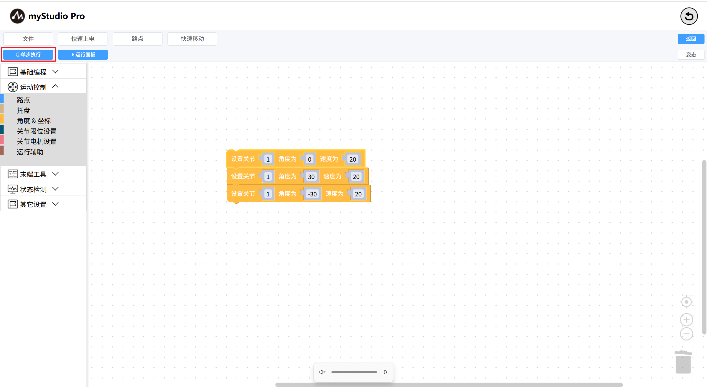
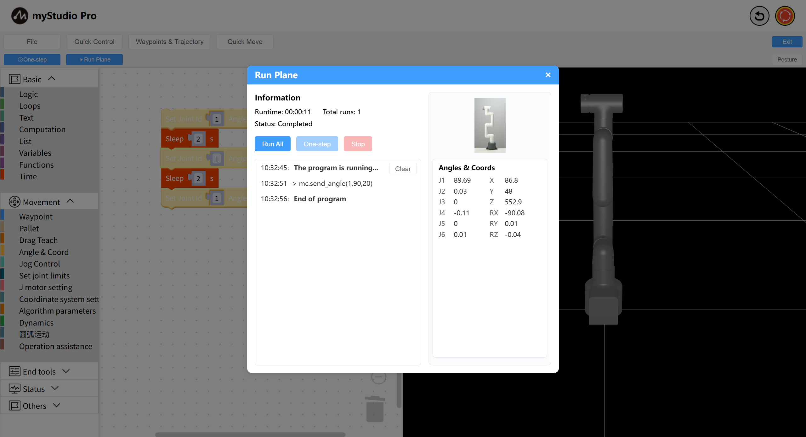

# Single-Step Execution

*Before You Begin*

> *1. Ensure the robot is powered on*
> 
> *2. Ensure the robot server is running*
> 
> *3. Ensure the robot is at zero position*

Single-step execution refers to executing a single block. When there are many blocks in the workspace, I want to execute just one to see the effect. This is where single-step execution comes in handy.

The **Single-Step** button is disabled by default and unclickable.

**Step 1:** Drag a few joint setting blocks into the workspace.

**Step 2:** Select the `Set Joint` block and observe that the **Single Step** button is unlocked (its color becomes darker)

**Step 3:** Click the **Single Step** button to open the Run panel. Click the `Run` button in the panel to start executing the code. Meanwhile, observe the changes in the robot arm's movement.

---

[← Previous Chapter](./5.5.6-useCoords.md) | [Next Chapter→](./5.5.8-program.md)