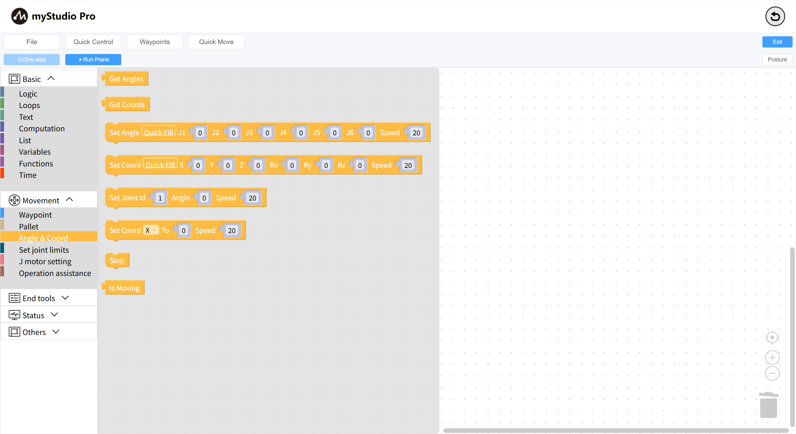
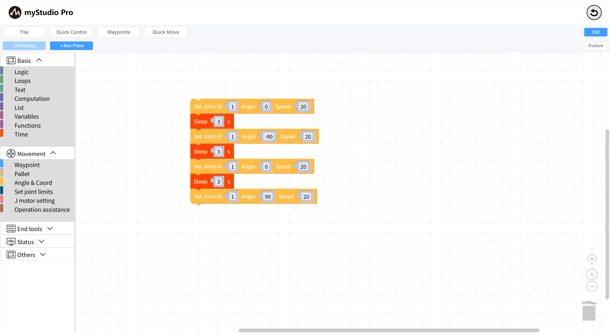

# Program Control

*Before You Begin*

> *1. Ensure the machine is powered on*
>
> *2. Ensure the machine is properly connected*

This chapter introduces how to debug block code through the `Run Panel` and implement `Pause`, `Resume`, **`Single Step`**, and `Stop` of the program.

Edit a program to control the movement of joint 1 of the robot arm

Click the `Run Panel` button. When the Run Panel pops up, click `Run All` and then immediately click the `Pause` button. The program will pause after executing the first instruction `mc.send_angle(1,0,20)`.

The program is paused. The next instruction to be executed, `time.sleep(3)`, appears.

At this point:

- If you click the `Resume` button, the program will automatically continue execution.
- If you click the `Step Into` button, the program will execute the next instruction, `mc.send_angle(1,-90,20)`.
- If you click the `Stop` button, the program will terminate.

As for what to do next, it’s up to you!

---

[← Previous Chapter](./5.5.7-singleStep.md) | [Next Chapter→](./5.5.9-waypoint.md)