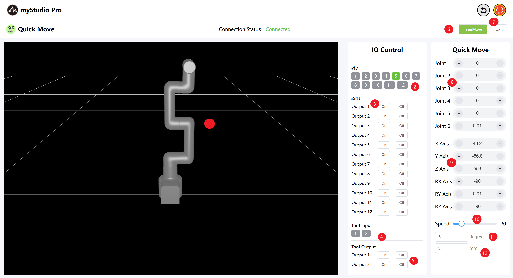
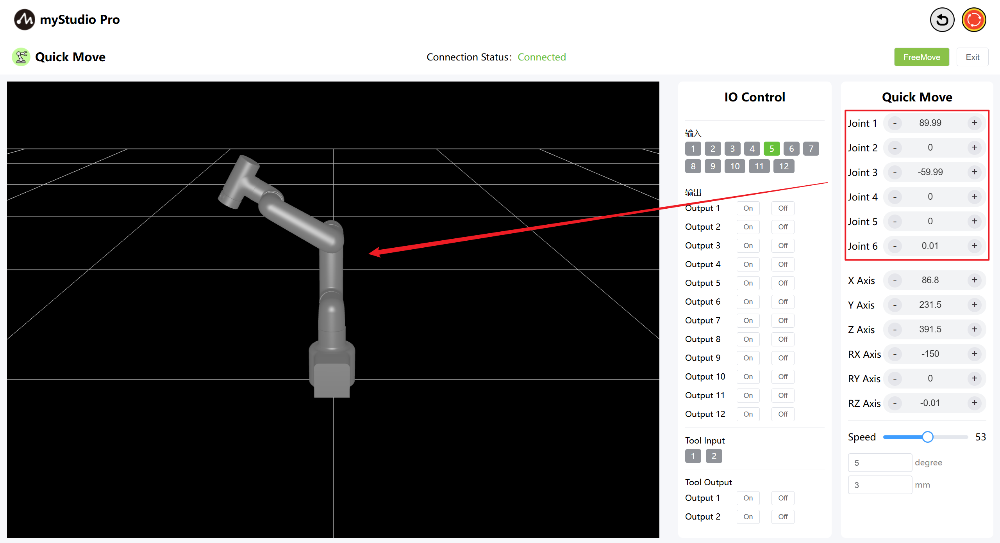
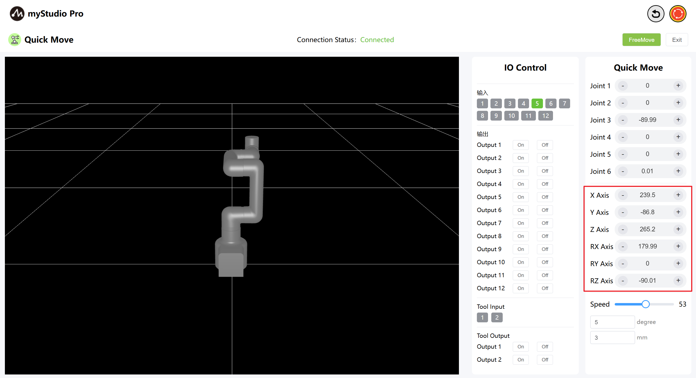
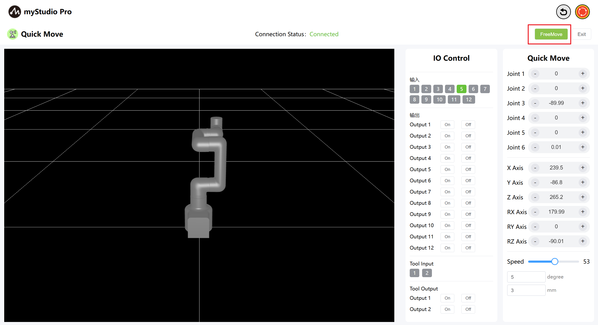
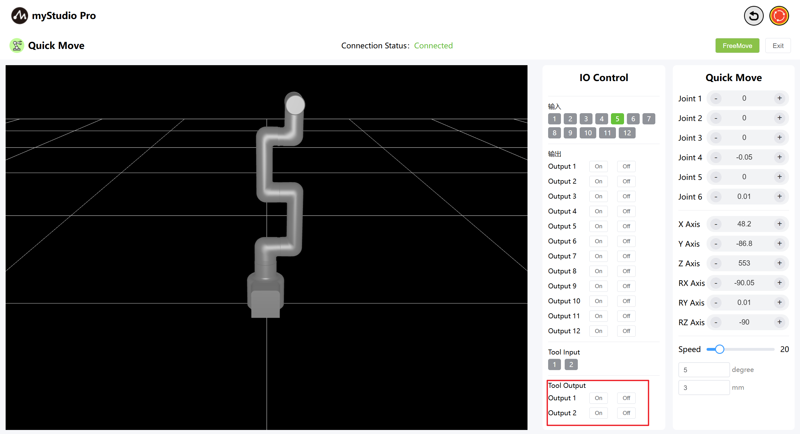
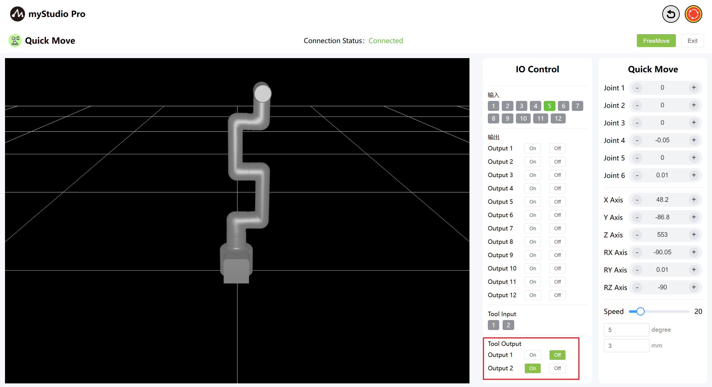

# Quick Move

*Before You Begin*

> 1.Ensure the machine is powered on
> 
> 2.Ensure the machine is properly connected and communicating
> 
> 3.Ensure the machine is in zero position
> 
> 4.The machine server is enabled

### 1 Interface Introduction

| Serial Number | **Description**                                                     |
| ---- | ------------------------------------------------------------ |
| 1 | MyCobotPro450 3D simulation model |
| 2 | Terminal IO pins 1 and 2, input |
| 3 | Terminal IO pins 1 and 2, output, used to control the Pro force-controlled gripper |
| 4 | Enable free movement mode |
| 5 | Exit the fast movement interface |
| 6 | Angle Control: Click the `+` or `-` buttons to control the joint angles of the robot arm. The values ​​represent the current joint angle information of the robot arm, and you can also directly modify the values ​​to control the joints. |
| 7 | Coordinate Control: Click the `+` or `-` buttons to control the coordinates of the robot arm. The values ​​represent the current coordinate posture information of the robot arm, and you can also directly modify the values ​​to control the coordinates. |
| 8 | Set the movement speed of the robot arm. The default is 10 mm/s. |
| 9 | Angle Step: The angle value to increase or decrease each time when adjusting the angle. |
| 10 | Coordinate Step: The coordinate value to increase or decrease each time when adjusting the coordinate posture.
### 2 Angle Control
In the Angle Control area, click the `+` and `-` buttons to control the joint angles of the robotic arm. The values ​​represent the current joint angles of the robotic arm. You can also directly modify the values ​​to control the joints.

### 3 Coordinate control
Before using coordinate control, move Joint 3 to an angle of approximately -90 degrees.

In the coordinate control area, click the `+` and `-` buttons to control the robot arm's coordinates. The values ​​represent the current robot arm's coordinate position information. You can also directly modify the values ​​to control the coordinates.

### 4 Free movement

By clicking the Free Move button, the free move mode is turned on. The interface button turns orange, indicating that the machine is in free move mode and can be dragged and moved.

The button turns yellow:

When the free movement button is yellow, clicking it again turns free movement mode off.

### 5 IO Control

#### 5.1 Terminal IO

Set terminal IO pins 1-2 as output to control the Pro force-controlled gripper.

Turn on the Pro force-controlled gripper by clicking the On/Off button.

Turn off the Pro Force Control Gripper by clicking the Off On button.

---

[← Previous Chapter](../5.5-blockly/5.5.10-gripperUse.md) | [Next Chapter→](../5.7-firmware/5.7.1-firmware_main.md)