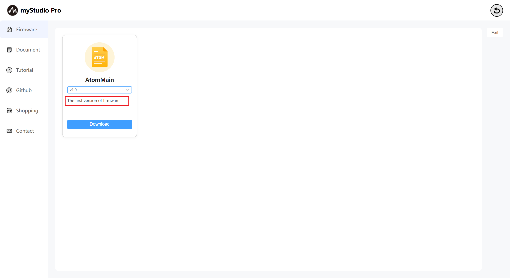
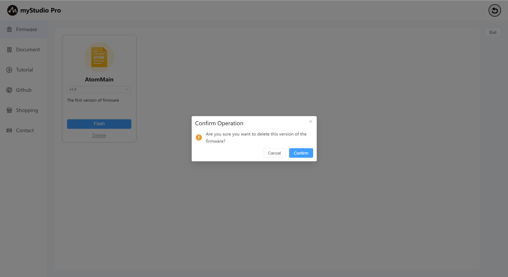
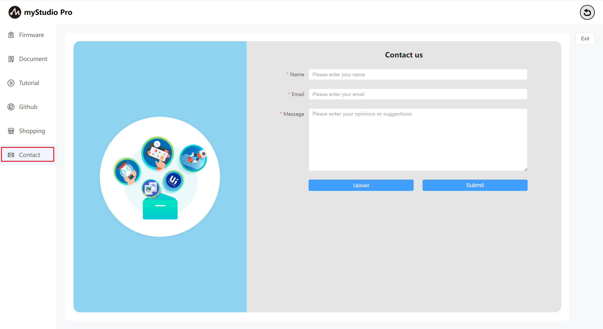

# Firmware And Applications
### 1 Interface Introduction

The homepage is as follows:

myCobotPro450 supports users to remotely upgrade and burn the latest version of the terminal firmware. The machine uses the latest version of the firmware by default when it leaves the factory. If a new version of the firmware is released later, you only need to keep the network connection open when using myStudio, and myStudio will automatically download the latest version of the firmware.

### 2 General Firmware

Function Description:

**AtomMain**

Terminal Firmware Name

**Version Number**

The default is the latest released firmware version, but you can also select another version for flashing.

### Description

This describes the firmware version, typically including update information for that version.

### **Delete**

Delete button: This button is used to delete the specified firmware version stored locally.

Click this button and a prompt will pop up, prompting you to confirm whether to delete the firmware. Click the **Confirm** button to confirm the deletion; click the " **Cancel** " button to cancel the deletion.

When there is firmware that has not been downloaded or the firmware has been deleted, the "**Flash**" button will become the "**Download**" button, and the "**Delete**" button will disappear. Clicking "**Download**" will automatically download the firmware.

After the download is complete, the **Flash** and **Delete** buttons will be restored.

### 3 Documentation Manual

This function is a web page link. Clicking it will open the product's GitBook page in the current browser.

### 4 Video Tutorials

This feature redirects to a webpage. Clicking it will open the official video account in your current browser. The English version will redirect to YouTube, while the Chinese version will redirect to Bilibili. The corresponding link will be accessed inline.

### 5 Github

This function is a web redirect link. Clicking it will open the official Github website in your current browser.

### 6 Online Store

This function is a web link. Clicking it will open the purchase interface for the corresponding product in the current browser. The Chinese version will redirect to Taobao, while the English version will redirect to [website name] and access the corresponding link in an embedded manner.

### 7 Contact Us

If you have any questions or comments, please contact us here.

Functional Description:

### Name

Enter your nickname here.

> This is a required field. If you submit without filling it in, you will be prompted with a corresponding text.

### Email

Enter your email address here.

> This is a required field. Enter your email address to facilitate further responses from our staff. If you submit without filling it in, you will be prompted with a corresponding text.

### Your Comments

Enter your comments here.

> This is a required field. Enter your questions or thoughts. If you submit without filling it in, you will be prompted with a corresponding text.

### Upload

> Click this button to upload a file. You can upload up to three files, and each file must not exceed 50MB.

> Click and a window will pop up for you to select a file.

> If the file you selected is larger than 50MB, it will fail to open after clicking "**Open**" and a window will pop up to remind you that the file is too large.

> When the number of files you want to upload exceeds 3, a pop-up window will appear to remind you.

### Submit

> Click the Submit button to submit all your information. This step may take some time, so please be patient.

---

[← Previous Chapter](../5.6-quickmove/5.6.1-quickmovefirstuse.md) | [Next Chapter→](../5.8-setting/5.8.1-setting_main.md)