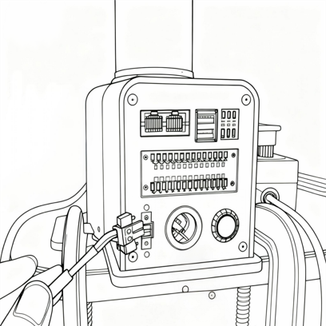

# First-time Use Guide For The Robot Arm
## Installation Method
1.Before you begin assembly, clean your work surface and gather the necessary tools.

  - Working Environment: Place the robot horizontally on a table capable of supporting at least three times the robot's own weight and within the robot's working range, with ample space for installation, use, maintenance, and repair.

  - Tool List: mycobot pro 450 robot, accessory kit, user guide, etc.

2.Place the robot arm flat on the table and position it towards the edge of the table, securing it with a G-clamp.

3.After the structure is installed, the next step of power connection can be carried out.

> **Note:**
> 1. When adjusting the robot's position on the base mounting platform, do not push or pull the robot directly on the base mounting platform to avoid scratches.
> 2. When manually moving the robot, do not apply external force to vulnerable parts of the robot to avoid unnecessary damage.

## Connect Power

> Tools required: mycobot pro 450 robotic arm with a pre-installed base mounting platform, 24V DC power supply, emergency stop button, etc.

> **Note:**
> 1. Please ensure that you have completed the above structural installation and secure the base of the robotic arm to the desktop to ensure safe operation.
> 2. Please follow the steps below to connect the power adapter to the corresponding port on the robotic arm:

Step  1：
Connect a DC power supply (make sure to use the official adapter, or a DC power supply with a DC24V 15A or higher) to the corresponding DC round connector on the mycobot pro 450 robot arm. Connect the other end of the adapter to a 110-220V power outlet.

Step  2：
Connect the emergency stop button to the corresponding interface on the mycobot pro 450 robot arm.

Step  3：
Connect the corresponding LAN1 interface on the mycobot pro 450 robot arm to the host computer.

Step  4：
Press the power button to turn on the device.

> **Note:**
> 1. The mycobot pro 450 must be powered by an external power supply to provide sufficient power.
> 2. Rated voltage: 24V
> 3. Rated current: 10A
> 4. Connector type: DC24V MIC4 (NEUTRIK XLR NC4FX equivalent)

## Gripper Installation And Use

You can refer to the following links:

- [Clamp installation](https://docs.elephantrobotics.com/docs/myGripper-F100-en/4-FirstInstallAndUse/4-FirstInstallAndUse.html)
- [Gripper use](./5.5-blockly/5.5.10-gripperUse.md)

[← Previous Chapter](../../2-BasicSettings/4.FirstTimeInstallation/4.3-PowerOnDetectionGuide.md) | [Next Chapter→](./5.1-myStudioFirstUse.md)